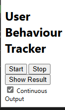

# USER TRACKING Extension

The USER TRACKING extension is a powerful tool designed to monitor and analyze user behavior on websites. It leverages advanced generative AI to provide insights into user interactions, making it an invaluable asset for web developers, UX researchers, and marketers seeking to understand and enhance user experience.

## Features

- **User Behavior Analysis**: Tracks clicks and interactions across all websites, providing a detailed narrative summary of user behavior.
- **Generative AI Integration**: Utilizes the `@google/generative-ai` library to generate content based on user interactions, offering unique insights into user behavior.
- **Comprehensive Tracking**: With permissions for storage and tabs, and host permissions for all URLs, the extension offers wide-ranging tracking capabilities.
- **Easy Interaction**: A simple popup interface allows users to interact with the extension without disrupting their browsing experience.

## Installation

1. Clone the repository or download the extension files to your local machine.
2. Navigate to `chrome://extensions` in your Chrome browser.
3. Enable Developer Mode by toggling the switch in the top right corner.
4. Click on "Load unpacked" and select the directory containing the extension files.
5. The extension should now be installed and visible in your extensions list.

## Usage
The extension is capable of running in two modes, *continuous output*, and *cumulative output*. The modes can be selected by checking and unchecking the *Continuous output* checkbox on the extension popup, before clicking on **START**.

- **Continuous Output** (*default*): In this mode, the user interaction details are printed on the console every 15 seconds. The details are printed and reset every time, hence are not accumulated.
- **Cumulative Output**: As is evident from its name, the interaction details are printed only on demand, either when the user clicks **STOP** and ends the data collection session or when they click **GET RESULT**.

The data will be printed in the console, where the user interaction data will be printed as an object, followed by the narration. Note that there may be some delay in the narration to print due to LLM api calls.

## Video Of Use
https://github.com/omgupta-iitk/user-interaction-extension/assets/44142719/f76dafbd-08e8-4d12-b2a1-946e12ad5370
## Dependencies

- `@google/generative-ai`: For generating content based on user interactions.
- `path-fixxer`: A utility for fixing path issues, especially when working with modules.
